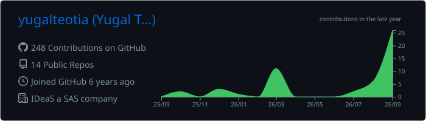
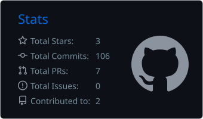
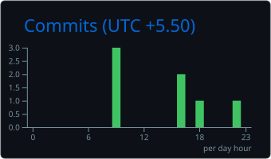
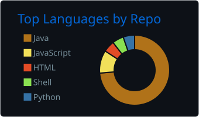
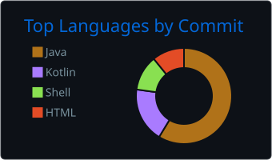

<h1 align="center">Hi, I'm Yugal Teotia 👋</h1>

  Backend-focused full-stack developer building reliable APIs, microservices, and web applications.

<h3 align="center">
  Let's Connect
  
</h3>

  
  

  

## About me

- 🔭 Building backend services and cross-product integrations with **Java, Spring Boot, gRPC, and MongoDB**
- 🧩 Working across microservices, automated testing, CI/CD workflows, and frontend features with **Ember.js**
- 🌱 Interested in scalable systems, clean architecture, and dependable developer tooling
- 💬 Ask me about **Java, REST/gRPC APIs, MongoDB, React, or Ember.js**

## Currently building

### 🎵 UNITY — P2P Music Sync

An Android app for synchronized group listening over a local Wi-Fi network—without a central server.

- **Kotlin, Jetpack Compose, Coroutines, Flow/StateFlow, and Media3/ExoPlayer**
- Leader/follower architecture with **TCP commands** and **UDP playback synchronization**
- Local MP3 playback, shared queue, late-join sync, reconnect handling, and background playback
- Currently validating pairing, playback, seeking, queue behavior, and synchronization on real devices

## Tech stack

  

## GitHub metrics

  

  
  

## Language usage

  
  

  Language cards summarize repository and commit usage; they do not represent proficiency.

## Contribution streak

  

  

